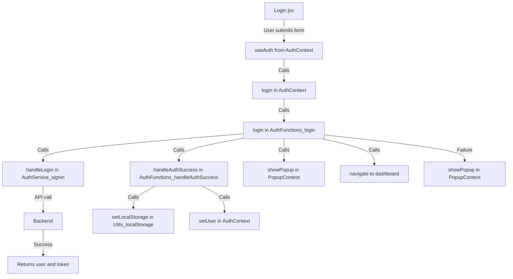
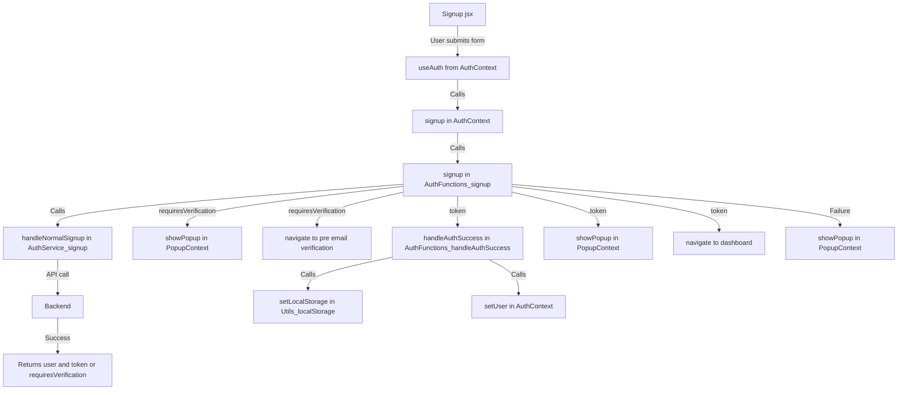
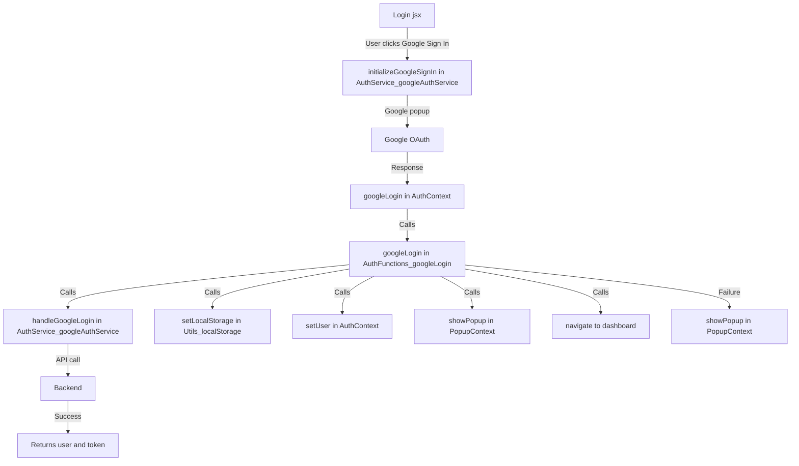
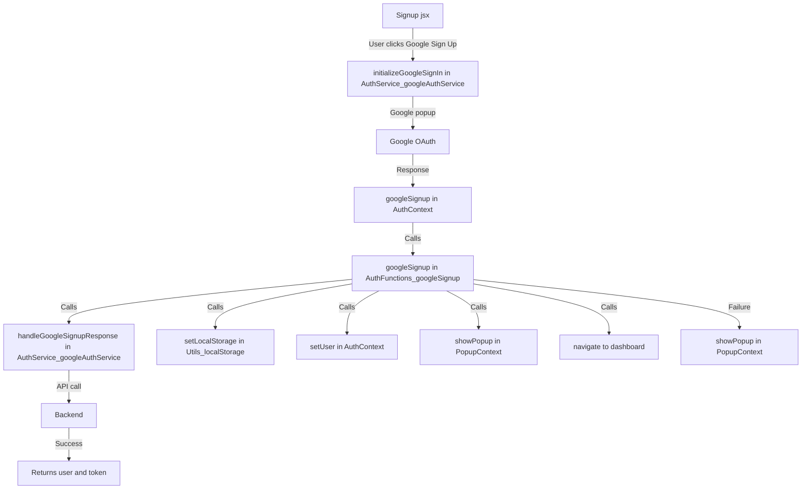
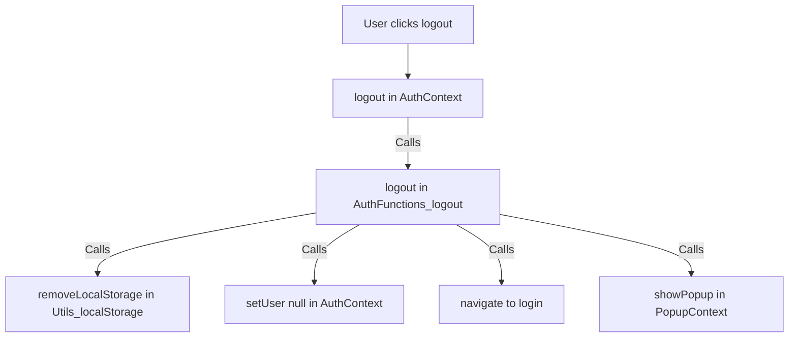
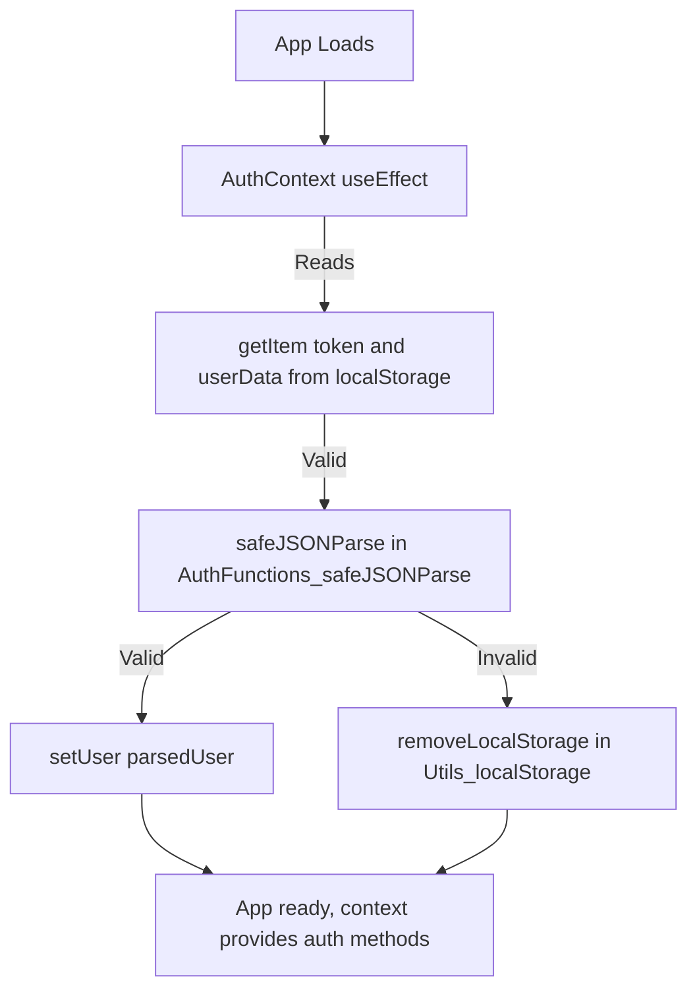
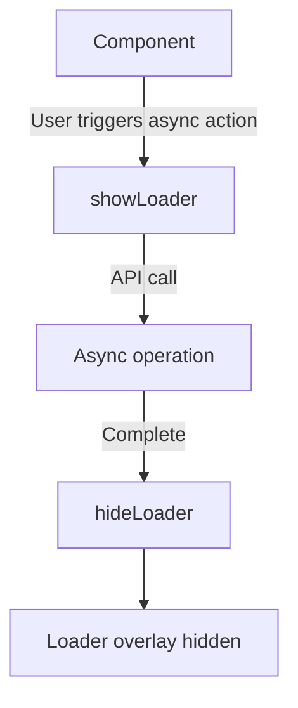

# 🛡️ Authentication Module — Developer Documentation

## Quickstart & Developer Guide

- **Wrap your auth routes (or the whole app) with `<LoaderProvider>` for global loading state.**
- **Use `useLoader` in any component to show/hide the loader during async actions.**
- **All auth logic is modularized in `AuthFunctions/` and managed by `AuthContext`.**
- **UI components (Login, Signup, etc.) use context and loader for a seamless UX.**

---

## Table of Contents
1. [System Overview](#system-overview)
2. [Directory Structure](#directory-structure)
3. [Authentication Flowcharts](#authentication-flowcharts)
4. [Context & AuthFunctions Structure](#context--authfunctions-structure)
5. [Loader Utility](#loader-utility)
6. [Component Integration](#component-integration)
7. [Extending the Auth Module](#extending-the-auth-module)
8. [Best Practices](#best-practices)
9. [Large-Scale Application Recommendations](#large-scale-application-recommendations)
10. [API Contracts (Example)](#api-contracts-example)
11. [FAQ / Troubleshooting](#faq--troubleshooting)

---

## 1. System Overview

This authentication module provides a robust, extensible, and maintainable solution for handling user authentication in a React application. It supports:
- Email/password login & signup
- Google OAuth login & signup
- Password reset and email verification
- Global loading state and user feedback via popups

---

## 2. Directory Structure

```
src/auth/
  components/         # UI components (Login, Signup, etc.)
  context/
    AuthContext/
      AuthContext.jsx
      AuthFunctions/  # Modular auth logic (login, signup, etc.)
    PopupContext/
  services/
    authService/      # API logic (Google, signup, signin, password)
  utils/
    loader.jsx        # Loader context and hook
    localStorage.js   # Utility for localStorage
    Popup/            # Popup logic
    index.js          # Barrel file for utils
  router/
    userRoutes.jsx    # All auth-related routes
```

---

## 3. Authentication Flowcharts

### 3.1 Email/Password Login Flow


### 3.2 Email/Password Signup Flow


### 3.3 Google Login Flow


### 3.4 Google Signup Flow


### 3.5 Logout Flow


### 3.6 Session Initialization (on App Load)


### 3.7 Loader Usage Flow


---

## 4. Context & AuthFunctions Structure

### AuthContext
- Provides: `user`, `loading`, `isAuthenticated`, `login`, `signup`, `googleLogin`, `googleSignup`, `logout`
- Handles session persistence via localStorage
- Uses modular AuthFunctions for logic
- Wraps all auth routes (see `userRoutes.jsx`)

### AuthFunctions
- Each function (login, signup, googleLogin, etc.) is in its own file for maintainability
- Handles API calls, state updates, and error handling
- Uses utility functions for localStorage and popups

---

## 5. Loader Utility

### How It Works
- The loader is a global context (`LoaderProvider`) that displays a spinner overlay when `showLoader()` is called and hides it with `hideLoader()`.
- Wrap your auth routes (or the whole app) with `<LoaderProvider>` (already done in `userRoutes.jsx`).
- Use the `useLoader` hook in any component to control the loader.

### Example Usage
```jsx
import { useLoader } from '../../utils';

const { showLoader, hideLoader } = useLoader();

const handleAsync = async () => {
  showLoader();
  try {
    // ...async logic
  } finally {
    hideLoader();
  }
};
```

### Where It's Used
- Login, Signup, ForgotPassword, ResetPassword, PreEmailVerification, and Google auth flows all use the loader for async actions.

---

## 6. Component Integration

- All auth-related components (Login, Signup, ForgotPassword, ResetPassword, PreEmailVerification) use the loader for async actions.
- Use `useLoader` from `../../utils` in any component under `LoaderProvider`.
- Use `showLoader()` before starting an async operation and `hideLoader()` in the `finally` block.
- The loader overlay is global and blocks user interaction while loading.

---

## 7. Extending the Auth Module

- To add a new auth method, create a new function in `AuthFunctions/` and wire it in `AuthContext.jsx`.
- To add a new provider (e.g., Facebook), add a new service and AuthFunction, then update the context and UI.
- To add new UI flows, create new components and add routes in `userRoutes.jsx`.
- Use the loader and popup utilities for consistent UX.

---

## 8. Best Practices

- **Type Safety:** Use TypeScript for large projects.
- **Security:** Use HttpOnly cookies for tokens in production. Never store sensitive data in localStorage.
- **Testing:** Add unit and integration tests for all auth logic.
- **Error Handling:** Use popups for user feedback and log errors for debugging.
- **Accessibility:** Ensure all forms and popups are accessible.
- **Environment Variables:** Store all API URLs and secrets in `.env` files.

---

## 9. Large-Scale Application Recommendations

### Security Improvements
- **Do not store JWTs or sensitive tokens in localStorage** for production. Use HttpOnly cookies to prevent XSS attacks.
- **Implement CSRF protection** if using cookies for authentication.
- **Rate limiting and brute-force protection** on the backend for login/signup endpoints.
- **Password policies** (complexity, expiration, etc.) and **2FA/MFA** for sensitive accounts.

### Scalability & Maintainability
- **Type Safety:** Use TypeScript for all code (context, functions, services, components).
- **Centralized Error Handling:** Use a global error boundary and error reporting/logging (e.g., Sentry).
- **Service Layer Abstraction:** Consider a generic API service layer for all HTTP requests (with retry, error handling, etc.).
- **Modularization:** As the app grows, split auth flows (login, signup, reset, social) into separate submodules/folders.
- **Testing:** Add unit tests for all AuthFunctions, integration tests for context, and E2E tests for flows.
- **Documentation:** Add API contract docs (request/response shapes), and a section on how to extend or override auth logic.

### User Experience
- **Loading States:** Show spinners/loaders for all async actions.
- **Accessibility:** Ensure all forms and popups are accessible (ARIA, keyboard navigation).
- **Internationalization:** Support for multiple languages if your app is global.

### DevOps & Deployment
- **Environment Variables:** All API URLs, client IDs, and secrets should be in `.env` files, not hardcoded.
- **CI/CD:** Lint, test, and build checks for all auth code.
- **Monitoring:** Track auth errors and suspicious activity.

### Advanced Features (for Large Scale)
- **Role-based Access Control (RBAC):** Support for user roles and permissions.
- **Session Management:** Support for session expiration, refresh tokens, and forced logout.
- **Audit Logging:** Track login attempts, password changes, etc.
- **Account Recovery:** Flows for forgotten email, locked accounts, etc.
- **Social Auth Extensibility:** Easy way to add more providers (Facebook, GitHub, etc.).

---

## 10. API Contracts (Example)

### POST /api/user/login
Request:
```json
{ "email": "user@example.com", "password": "..." }
```
Response:
```json
{ "token": "...", "user": { "id": "...", "email": "..." } }
```

### POST /api/user/google-login
Request:
```json
{ "token": "google_id_token" }
```
Response:
```json
{ "token": "...", "user": { "id": "...", "email": "..." } }
```

---

## 11. FAQ / Troubleshooting

- **Q:** Why is the loader not showing?
  **A:** Ensure your component is under `<LoaderProvider>` and you are using `useLoader` from the correct import path.
- **Q:** How do I add a new auth provider?
  **A:** Add a new AuthFunction and service, then wire it in `AuthContext.jsx` and the UI.
- **Q:** Why am I getting CORS errors?
  **A:** Check your backend CORS config and .env API URLs.
- **Q:** Why is my JWT not being accepted?
  **A:** Check token expiration, audience, and signature. Ensure the backend and frontend use the same secret/public key.

---

For more details, see the code comments and each component's usage of the loader and context hooks.